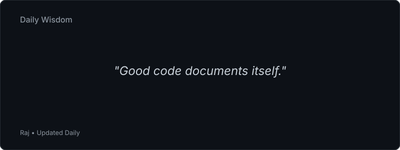

<!-- DAILY_WISDOM_START -->

<!-- DAILY_WISDOM_END -->

I'm a developer and product builder who likes turning half-formed ideas into software people actually use.

Most of what I do sits somewhere between full-stack development, AI, and automation, and I like staying involved from the first sketch of an idea through to shipping it.

## About Me

I build software that solves real problems, not software for its own sake. Right now that means:

* Full-Stack Web Development
* Artificial Intelligence
* Automation Systems
* SaaS Products
* Backend Architecture
* Product Design & UX
* Startup Building

The work I'm proudest of usually sits where engineering, design, and business overlap.

## Current Projects

### CreatorOS (In Progress)

CreatorOS pulls content management, publishing, analytics, automation, and growth tools into one place instead of ten different tabs.

**Key Areas**

* Social media integrations
* Analytics dashboards
* Content scheduling
* AI-assisted workflows
* Creator productivity systems

---

### Project JARVIS (Phase 1 Complete)

A personal AI assistant built around local infrastructure instead of someone else's cloud. The goal is one operator that can help manage the day-to-day: tasks, information, and the small automations that used to eat my time.

**Key Areas**

* Local AI deployment
* Raspberry Pi infrastructure
* Automation systems
* Smart integrations
* Productivity workflows

---

### Personal Portfolio

My portfolio site, built to actually load fast and show the work instead of just describing it. It's where engineering and design decisions both have to hold up, since it's usually the first thing people see.

---

### Kaisei Studio (Founder & CEO)

Kaisei Studio is the company I run outside of these projects. The brand essence is the short version of how I try to work everywhere: build with precision, manage with care, evolve everything.

## Tech Stack

### Languages

* JavaScript
* TypeScript
* Python
* HTML
* CSS

### Frontend

* React
* Next.js
* Tailwind CSS

### Backend

* Node.js
* Express.js
* REST APIs

### Databases

* MongoDB
* MySQL
* Firebase
* Supabase

### Tools & Platforms

* Git
* GitHub
* Vercel
* Figma
* Notion
* TensorFlow
* Arduino
* Home Assistant

## What I Bring

* Product-first thinking
* Strong UI/UX awareness
* Full-stack development experience
* Rapid prototyping ability
* Entrepreneurial mindset
* Interest in both technology and business

I'd rather build the system underneath a feature than just the feature itself.

## Currently Exploring

* Advanced TypeScript patterns
* Scalable backend architecture
* AI-powered developer workflows
* Intelligent automation systems
* SaaS growth strategies

## Open To

* Internship Opportunities
* Startup Collaborations
* Freelance Projects
* Open Source Contributions
* Technical Partnerships

## Connect

  
  

