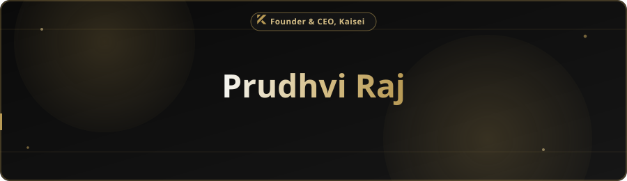
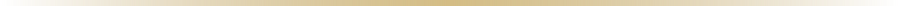
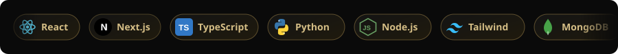

<div align="center">

<a href="https://www.theraj.live">
  
</a>

<br />

<a href="https://github.com/Prudhvi-Raj1806">
  
</a>
<a href="https://github.com/Prudhvi-Raj1806?tab=repositories">
  
</a>
<a href="https://www.theraj.live">
  
</a>

<br />
<br />

> **Founder · AI product engineer · interface designer**<br />
> Building CreatorOS, Project JARVIS, and digital products that feel as good as they function.

</div>



## `/whoami`

I’m **Prudhvi Raj**, a founder and full-stack developer based in Bangalore, India. I work at the intersection of **AI, automation, product engineering, and premium interface design**.

I care about the part most projects miss: turning a technically capable system into a product people actually want to use.

```text
focus = ["AI products", "agentic workflows", "full-stack systems", "quiet-luxury interfaces"]
building = ["CreatorOS", "Project JARVIS", "Kaisei"]
principle = "Make the complex feel inevitable."
```

<div align="center">
  
</div>

## Selected work

A curated cut of the repositories that best represent how I think and build.

<table>
<tr>
<td width="50%" valign="top">

### [Project JARVIS](https://github.com/Prudhvi-Raj1806/Agent-_Project)

An experimental AI-agent interface for exploring agentic workflows and interactive product experiences.

`Next.js` `React` `TypeScript`

</td>
<td width="50%" valign="top">

### [FinStreak](https://github.com/Prudhvi-Raj1806/finstreak)

A financial planning and tracking product experiment designed to make cash flow and money decisions easier to understand.

`React` `TypeScript` `Vite`

</td>
</tr>
<tr>
<td width="50%" valign="top">

### [Project Luxe](https://github.com/Prudhvi-Raj1806/Project-Luxe)

An editorial e-commerce concept that replaces conventional scrolling with a boutique-style discovery ritual.

`Next.js` `UI systems` `E-commerce`

</td>
<td width="50%" valign="top">

### [Project Canvas](https://github.com/Prudhvi-Raj1806/Project-Canvas)

An interactive portfolio grid driven by cursor movement, scroll depth, and dynamic color transitions.

`HTML` `CSS` `JavaScript`

</td>
</tr>
<tr>
<td width="50%" valign="top">

### [Project Terminal](https://github.com/Prudhvi-Raj1806/Project-Terminal)

A developer-centric portfolio interface with file navigation, syntax-oriented presentation, and a functional command-line model.

`HTML` `CSS` `JavaScript`

</td>
<td width="50%" valign="top">

### [CS Forensics Toolkit](https://github.com/Prudhvi-Raj1806/CS-Forensics-toolkit)

A practical collection of computer-science and digital-forensics utilities and experiments.

`Python` `Forensics` `Tooling`

</td>
</tr>
</table>

<details>
<summary><strong>More experiments</strong></summary>
<br />

[Project Nexus](https://github.com/Prudhvi-Raj1806/Project-Nexus) · [Project Ghost](https://github.com/Prudhvi-Raj1806/Project-Ghost) · [LMS Sample](https://github.com/Prudhvi-Raj1806/LMS-Sample) · [Daily Wisdom](https://github.com/Prudhvi-Raj1806/daily-wisdom) · [IV Monitor](https://github.com/Prudhvi-Raj1806/IV_Monitor)

</details>

## Stack

<div align="center">


</div>

<details>
<summary><strong>How I work</strong></summary>
<br />

- Start with the product constraint, not the framework.
- Use interaction and motion to clarify hierarchy, not decorate empty space.
- Keep the underlying system understandable, testable, and easy to extend.
- Prefer distinctive, intentional interfaces over template-shaped UI.

</details>

## A few signals

<div align="center">

<a href="https://github.com/Prudhvi-Raj1806">
  
</a>
<a href="https://github.com/Prudhvi-Raj1806">
  
</a>

</div>

<div align="center">
  
</div>

## Connect

<div align="center">

[**Website**](https://www.theraj.live) · [**GitHub**](https://github.com/Prudhvi-Raj1806) · [**All repositories**](https://github.com/Prudhvi-Raj1806?tab=repositories)

<br />
<br />


<sub>Building deliberately. Shipping often.</sub>

</div>
